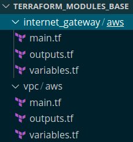

# Terraform Base Modules

## Description

    The Repository contains base Terraform's modules adapted to company usage

### Structure
* __Base modules__

    * Repository: https://github.com/maxibra/terrafor_modules_base
    * Description:
        * Contains modules with local implementations of base terraform's resources

        

* __Management__
    * To update any module create/checkout to branch with the same name
    * Remove all modules except you are commit
    * Create release based on the branch
        * NOTE: Please describe the Affected Module
    * Merge the branch to master(main)